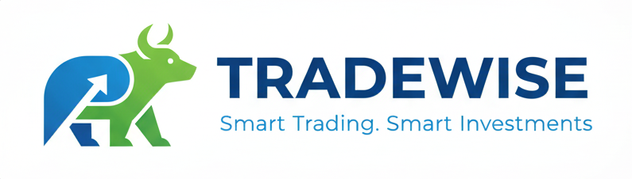

"<div align="center">
  


#  Tradewise - Full Stack Trading Platform

### A Modern MERN Stack Trading Platform

[](https://github.com/Chhatrapati-sahu-09/Tradewise-Full-Stack-MERN-Project)
[](https://reactjs.org/)
[](https://nodejs.org/)
[](https://expressjs.com/)
[](https://www.mongodb.com/)
[](LICENSE)
[](https://github.com/Chhatrapati-sahu-09/Tradewise-Full-Stack-MERN-Project/stargazers)

</div>

---

A full-stack MERN (MongoDB, Express.js, React, Node.js) trading platform clone inspired by Zerodha. This project features a complete trading dashboard with holdings, positions, and order management capabilities.

> ⚠️ **Note**: Some backend routes and authentication code are not pushed to this repository due to security considerations and API key restrictions. The current version includes core functionality with mock data support.

---

##  Frontend Overview

<div align="center">
  
  
</div>

<div align="center">
  
  
</div>

<div align="center">
  
  
</div>

---

##  Dashboard Preview

<div align="center">
  
  
</div>

<div align="center">
  
  
</div>

---

##  Features

### Frontend (Landing Page)
- Modern and responsive landing page
- Product showcase and pricing information
- About section with team information
- Support and ticket creation system
- Educational resources section
- Mobile-friendly design

<details>
<summary><b> Click to view detailed Landing Page sections with screenshots</b></summary>

##  Landing Page – Section-wise Description

### 1.  Hero Section – "Invest in Everything"

**What this section does:**
Introduces the platform as a one-stop solution for investing in stocks, derivatives, mutual funds, and more.

**Key features shown:**
- ✓ Direct, bold headline to build user trust
- ✓ Clear subheading explaining the platform's purpose
- ✓ Prominent **"Signup Now"** call-to-action button to drive conversions

**Purpose:**
Immediately communicate what the platform offers and encourage users to start the registration process.

---

### 2.  Achievements & Largest Broker Section

**What it communicates:**
This section highlights the platform's credibility and scale.

**Key points included:**
- → Awards and recognitions
- → "Largest stock broker in India" style message
- → Statistics showing how many users trust the platform
- → Lists of investable categories:
  - Futures & Options
  - Commodity derivatives
  - Currency derivatives
  - Stocks & IPOs
  - Direct mutual funds
  - Government bonds & securities

**Purpose:**
Builds trust by showcasing reputation, scale, and investment variety.

---

### 3.  Trust Section – "Trust with Confidence"

**This part focuses on the values and reliability of the platform.**

**Highlights:**
- ✓ Customer-first approach
- ✓ No spam or gimmicks (trust-building)
- ✓ Complete product ecosystem - network of apps that enhance user experience
- → Tools/apps shown visually:
  - **Streak** - Algo trading
  - **Kite** - Trading platform
  - **Coin** - Mutual funds
  - **Console** - Portfolio analytics
  - **Smallcase** - Thematic investing
  - And more...

**Purpose:**
Shows transparency, reliability, and a strong product ecosystem behind the trading experience.

---

### 4.  Pricing Section – Unbeatable Pricing

**This section clearly lists the platform's pricing benefits.**

**Includes:**
- → **Free equity delivery**
- → **₹20 flat** intraday & F&O trades
- → **Free direct mutual funds**
- → No hidden charges

**Purpose:**
Demonstrates affordability and transparent pricing. This is a major reason users choose discount brokers—clear pricing helps convince visitors to sign up.

---

### 5.  Free Market Education Section – "Varsity"

**This part promotes educational resources.**

**What it shows:**
- → Visual/illustration of learning modules
- → Description of free, open market education
- → Two important resources:
  - **Varsity** - Comprehensive stock market learning
  - **TradingQ&A** - Community-driven help platform

**Purpose:**
Shows that the platform helps users **learn**, not just trade. Empowers beginners with knowledge.

---

### 6.  Account Opening Section

**A simple, clear CTA section inviting users to join.**

**Headline:** "Open a Zerodha account"

**Highlights:**
- → Modern trading platform
- → Free investments
- → Transparent pricing
- → Quick signup process

**CTA Button:** **Sign up Now**

**Purpose:**
Drive conversions by reminding visitors that account opening is simple and free.

---

### 7.  Technology Section – Modern & Intuitive Trading Platforms

**Description:**
Explains the technology behind the trading app.

**Focus:**
- → Sleek UI/UX design
- → Fast performance
- → Streaming market data
- → Advanced charts and analytics
- → Mobile + desktop experience

**Also includes:**
- → **Demo link** - Try before you invest
- → **Mobile app download buttons** - iOS & Android

**Purpose:**
Communicates that the platform is fast, modern, and accessible across all devices.

---

### 8.  Pricing Breakdown Page

**Provides detailed pricing for every product:**

| Service | Price |
|---------|-------|
| Equity Delivery | ₹0 |
| Intraday & F&O | ₹20 per trade |
| Mutual Funds | ₹0 |
| Currency Trading | ₹20 per trade |
| Commodity Trading | ₹20 per trade |

**Purpose:**
Crystal clear, transparent breakdown that helps users understand costs with **no hidden charges**.

---

### 9.  Support Portal Section

**A dedicated help & support system.**

**Includes:**
- → **Search bar** for queries
- → **Quick help buttons:**
  - Track segment activation
  - Intraday margins
  - User manual
  - Trading guides
- → **Featured articles**
- → **Create support tickets for:**
  - Account Opening
  - Funding & Withdrawals
  - Trading & Platform Issues
  - Technical problems

**Purpose:**
Helps users self-solve queries and raise tickets smoothly. Reduces support load with self-service options.

---

### → Landing Page Key Features Summary

✓ **Clear Value Proposition** - Invest in everything message  
✓ **Trust Signals** - Awards, scale, and recognition  
✓ **Transparent Pricing** - No hidden fees, clear costs  
✓ **Educational Content** - Free learning resources  
✓ **Modern UI/UX** - Clean, professional design  
✓ **Mobile Responsive** - Works on all devices  
✓ **Strong CTAs** - Multiple signup opportunities  
✓ **Support System** - Comprehensive help center  

</details>

---

### Dashboard
- **Holdings Management**: View and manage your stock holdings
- **Positions Tracking**: Monitor your active trading positions
- **Order Placement**: Buy and sell stocks with a clean interface
- **Real-time Updates**: Dynamic data visualization with charts
- **Portfolio Summary**: Overview of total investments and returns
- **Watchlist**: Track your favorite stocks

### Backend API
- RESTful API endpoints for all operations
- MongoDB integration for data persistence
- CORS enabled for cross-origin requests
- Error handling and validation
- Graceful fallback when database is unavailable

##  Project Structure

```
zerodha-clone/
├── backend/              # Express.js API server
│   ├── model/           # Mongoose models
│   ├── schemas/         # Database schemas
│   ├── index.js         # Main server file
│   └── package.json
├── frontend/            # React landing page
│   ├── public/          # Static assets
│   ├── src/
│   │   ├── landing_page/  # Landing page components
│   │   └── test/          # Test files
│   └── package.json
├── dashboard/           # React trading dashboard
│   ├── public/
│   ├── src/
│   │   ├── components/    # Dashboard components
│   │   └── data/          # Mock data
│   └── package.json
└── README.md
```

##  Technologies Used

### Frontend
- **React** 19.1.1 - UI library
- **React Router DOM** - Navigation
- **Axios** - HTTP client
- **Chart.js** - Data visualization
- **Material-UI** - UI components (Dashboard)

### Backend
- **Node.js** - Runtime environment
- **Express.js** 5.1.0 - Web framework
- **MongoDB** - Database
- **Mongoose** - ODM library
- **CORS** - Cross-origin resource sharing
- **dotenv** - Environment variable management
- **Nodemon** - Development server

##  Prerequisites

Before running this project, make sure you have:

- Node.js (v20.x or higher)
- MongoDB (local installation or MongoDB Atlas account)
- npm or yarn package manager

##  Installation & Setup

### 1. Clone the Repository

```bash
git clone https://github.com/Chhatrapati-sahu-09/Tradewise-Full-Stack-MERN-Project.git
cd Tradewise-Full-Stack-MERN-Project
```

### 2. Backend Setup

```bash
cd backend
npm install
```

Create a `.env` file in the backend directory:

```env
PORT=3002
MONGO_URL=your_mongodb_connection_string
```

**Note:** Get your MongoDB connection string from [MongoDB Atlas](https://www.mongodb.com/cloud/atlas) or use a local MongoDB instance.

### 3. Frontend Setup

```bash
cd ../frontend
npm install
```

### 4. Dashboard Setup

```bash
cd ../dashboard
npm install
```

##  Running the Application

You need to run all three parts of the application:

### Terminal 1 - Backend Server (Port 3002)
```bash
cd backend
npm start
```

### Terminal 2 - Frontend (Port 3000)
```bash
cd frontend
npm start
```

### Terminal 3 - Dashboard (Port 3001)
```bash
cd dashboard
set PORT=3001 && npm start
# Or on Mac/Linux:
# PORT=3001 npm start
```

##  Access the Application

Once all services are running:

- **Landing Page**: http://localhost:3000
- **Trading Dashboard**: http://localhost:3001
- **Backend API**: http://localhost:3002

##  API Endpoints

### Holdings
- `GET /allHoldings` - Fetch all holdings

### Positions
- `GET /allPositions` - Fetch all positions

### Orders
- `POST /newOrder` - Create a new order
  ```json
  {
    "name": "STOCK_NAME",
    "qty": 10,
    "price": 1500.50,
    "mode": "BUY"
  }
  ```

##  Free Stock Market APIs (Alternatives)

Since this project requires real-time stock data, here are some free APIs you can integrate:

### 1. **Alpha Vantage** (Recommended)
- **Website**: https://www.alphavantage.co/
- **Free Tier**: 500 API calls/day
- **Features**: Real-time & historical stock data, forex, crypto
- **Setup**:
  ```javascript
  const API_KEY = 'your_api_key_here';
  const url = `https://www.alphavantage.co/query?function=GLOBAL_QUOTE&symbol=IBM&apikey=${API_KEY}`;
  ```

### 2. **Finnhub**
- **Website**: https://finnhub.io/
- **Free Tier**: 60 API calls/minute
- **Features**: Real-time stock prices, company news, financial statements
- **Setup**:
  ```javascript
  const finnhubClient = require('finnhub');
  const api_key = finnhub.ApiClient.instance.authentications['api_key'];
  api_key.apiKey = "YOUR_API_KEY";
  ```

### 3. **IEX Cloud**
- **Website**: https://iexcloud.io/
- **Free Tier**: 50,000 messages/month
- **Features**: Stock quotes, historical data, company info

### 4. **Yahoo Finance API (Unofficial)**
- **Package**: `yahoo-finance2`
- **Free**: Unlimited (unofficial)
- **Setup**:
  ```bash
  npm install yahoo-finance2
  ```
  ```javascript
  const yahooFinance = require('yahoo-finance2').default;
  const quote = await yahooFinance.quote('AAPL');
  ```

### 5. **Twelve Data**
- **Website**: https://twelvedata.com/
- **Free Tier**: 800 API calls/day
- **Features**: Real-time & historical data for stocks, forex, crypto

### Integration Example (Alpha Vantage)

```javascript
// backend/routes/stocks.js
const axios = require('axios');

app.get('/api/stock/:symbol', async (req, res) => {
  try {
    const { symbol } = req.params;
    const API_KEY = process.env.ALPHA_VANTAGE_KEY;
    const response = await axios.get(
      `https://www.alphavantage.co/query?function=GLOBAL_QUOTE&symbol=${symbol}&apikey=${API_KEY}`
    );
    res.json(response.data);
  } catch (error) {
    res.status(500).json({ error: 'Failed to fetch stock data' });
  }
});
```

Add to your `.env`:
```env
ALPHA_VANTAGE_KEY=your_api_key_here
```

##  Configuration

### MongoDB Setup

1. **Using MongoDB Atlas** (Recommended for production):
   - Create a free account at [MongoDB Atlas](https://www.mongodb.com/cloud/atlas)
   - Create a new cluster
   - Get your connection string
   - Update `backend/.env` with your connection string

2. **Using Local MongoDB**:
   - Install MongoDB locally
   - Update `backend/.env`:
   ```env
   MONGO_URL=mongodb://localhost:27017/zerodha
   ```

### Port Configuration

If you need to change the default ports, update:

- **Backend**: Change `PORT` in `backend/.env`
- **Frontend**: Runs on port 3000 by default (React default)
- **Dashboard**: Set `PORT` environment variable before starting

##  Important Notes

### Backend Code Limitations
Some advanced backend features are **not included** in this repository:
- User authentication & JWT implementation
- Payment gateway integration
- Advanced order validation logic
- Real-time WebSocket connections
- Rate limiting middleware
- Some proprietary trading algorithms

These were excluded due to:
- Security concerns with API keys
- Complexity that needs separate configuration
- Educational focus on core MERN concepts

The current version provides a **fully functional demo** with mock data support and can be extended based on your needs.

##  Troubleshooting

### Database Connection Issues

If you see MongoDB connection errors:
1. Verify your connection string in `.env`
2. Check if your IP is whitelisted in MongoDB Atlas
3. Ensure MongoDB service is running (for local setup)
4. The app will still run with limited functionality if DB is unavailable

### Port Already in Use

If you get "port already in use" errors:
```bash
# Windows
taskkill /F /IM node.exe

# Mac/Linux
killall node
```

### CORS Issues

Make sure the backend CORS configuration allows requests from your frontend URLs.

##  Build for Production

### Frontend
```bash
cd frontend
npm run build
```

### Dashboard
```bash
cd dashboard
npm run build
```

The production builds will be in the `build/` directories.

##  Contributing

Contributions are welcome! Please follow these steps:

1. Fork the repository
2. Create a new branch (`git checkout -b feature/improvement`)
3. Commit your changes (`git commit -am 'Add new feature'`)
4. Push to the branch (`git push origin feature/improvement`)
5. Create a Pull Request

##  License

## 🔮 Future Enhancements

- [ ] User authentication and authorization (JWT)
- [ ] Real-time stock price updates via WebSocket
- [ ] Integration with free stock APIs (Alpha Vantage, Finnhub)
- [ ] Advanced charting with technical indicators
- [ ] Portfolio performance analytics
- [ ] Trade history and reporting
- [ ] Payment gateway integration
- [ ] Mobile app version (React Native)
- [ ] Dark mode support
- [ ] Multi-language support
- [ ] Push notifications for price alerts
- [ ] Social trading features

##  Acknowledgments

- Inspired by Zerodha's trading platform
- Built as a learning project for MERN stack development
- Thanks to the open-source community for various libraries and tools

##  Screenshots & Dashboard Features

### Dashboard Overview

### 1.  Market Indicators (Top Header)

**Purpose:** 
Shows the live market trend of India's two biggest stock indices:
- **NIFTY 50** - National Stock Exchange index
- **SENSEX** - Bombay Stock Exchange index

**What it tells the user:**
Provides quick insight into the overall market condition (bullish/bearish status) before checking personal holdings.

---

### 2.  Search Bar & Stock List (Left Panel)

**Purpose:**
- Quick search functionality for stocks by name or symbol
- Examples: INFY, TCS, M&M, Gold MCX, etc.

**Left Sidebar - List of Stocks:**
Displays a scrollable watchlist with:
- Stock name (e.g., INFY, ONGC, WIPRO)
- Percentage change for the day
- Current price

**User Benefit:** Fast filtering and easy navigation inside the holdings list.

---

### 3.  Equity Section (Main Dashboard Panel)

**Details shown:**
- **Equity Balance:** Total funds in the trading account
- **Margin Available:** Remaining margin capacity
- **Margins Used:** Currently utilized margin
- **Opening Balance:** Starting account balance

**Purpose:** Shows the financial summary of the user's account at a glance.

---

### 4.  Holdings Summary (Dashboard Middle Section)

**Metrics displayed:**
- **Total Investment:** Total amount invested
- **Current Value:** Present worth of all holdings
- **P&L (Profit/Loss):** Overall gain/loss
- **Percentage Return:** Performance in percentage

**Purpose:** Provides a clear summary of all stock holdings and their performance.

---

### 5.  Donut Chart (Portfolio Distribution)

**Purpose:** Visual breakdown of portfolio based on stock weightage.

**Each color represents:**
- INFY, ONGC, TCS, KPITTECH, QUICKHEAL
- WIPRO, M&M, RELIANCE, HUL, and more

**User Benefits:**
- Identifies which stock has highest allocation
- Shows whether portfolio is diversified or concentrated
- Easy to spot overweight/underweight positions

---

### 6.  Holdings Detailed Table (Holdings Tab)

**Comprehensive stock information:**

| Field | Description |
|-------|-------------|
| Instrument | Stock name/symbol |
| Quantity | Number of shares held |
| Avg. Cost | Average purchase price |
| LTP | Last Traded Price |
| Current Value | Present worth (Qty × LTP) |
| P&L | Profit/Loss amount |
| % Change | Return percentage |

**Purpose:** Allows detailed analysis of every individual stock's performance.

---

### 7.  Positions Section (Active Trades Tab)

**Contains open positions that are not yet closed:**

**Fields include:**
- **Product Type:** CNC (Cash & Carry), MIS (Intraday)
- **Instrument:** Stock name (e.g., EVERREADY, JUBLFOOD)
- **Quantity:** Number of shares
- **Avg. Price:** Average buy price
- **LTP:** Current market price
- **Unrealized P&L:** Profit/Loss on open position
- **Day Change %:** Intraday percentage movement

**Purpose:** Helps users monitor active trades and decide whether to hold, exit, or average down/up.

---

### 8. → Key Dashboard Features

✓ **Real-time Updates:** Live price changes and P&L calculations  
✓ **Visual Analytics:** Charts and graphs for better insights  
✓ **Quick Actions:** Buy/Sell buttons for instant trading  
✓ **Portfolio Tracking:** Complete overview of investments  
✓ **Risk Management:** Margin and exposure monitoring  
✓ **Performance Metrics:** Detailed profit/loss analysis  

---

##  Future Enhancements

- [ ] User authentication and authorization (JWT)
- [ ] Real-time stock price updates via WebSocket
- [ ] Integration with free stock APIs (Alpha Vantage, Finnhub)
- [ ] Advanced charting with technical indicators
- [ ] Portfolio performance analytics
- [ ] Trade history and reporting
- [ ] Payment gateway integration
- [ ] Mobile app version (React Native)
- [ ] Dark mode support
- [ ] Multi-language support
- [ ] Push notifications for price alerts
- [ ] Social trading features

##  Support

For support, create an issue in the GitHub repository or reach out via:
- **GitHub**: [@Chhatrapati-sahu-09](https://github.com/Chhatrapati-sahu-09)
- **Email**: Contact through GitHub profile

##  Disclaimer

This project is for **educational purposes only**. It is not intended for actual trading or financial transactions. Always consult with financial advisors before making investment decisions.

---

<div align="center">

###  Star this repository if you find it helpful!

Made with  by [Chhatrapati Sahu](https://github.com/Chhatrapati-sahu-09)

[](https://github.com/Chhatrapati-sahu-09)
[](https://github.com/Chhatrapati-sahu-09/Tradewise-Full-Stack-MERN-Project)

</div>reate an issue in the GitHub repository.

---

⭐ Star this repository if you find it helpful!" 
